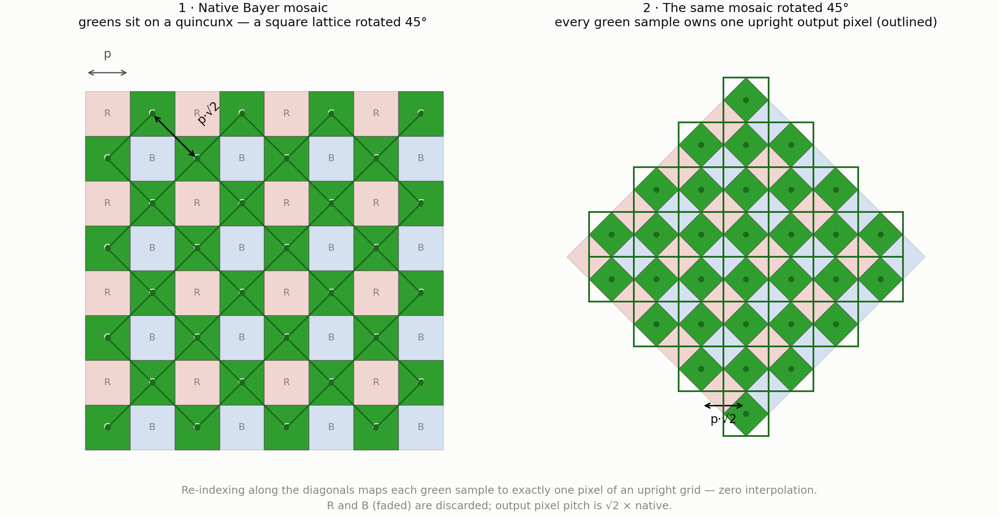

# rwmono — monochrome raw conversion without demosaicing for CFA sensors

`rwmono` converts Bayer-sensor raw files directly into **monochrome linear DNG** files, without ever demosaicing. No missing color value is interpolated, no luminance is invented: every output pixel is derived arithmetically from photosites that were actually measured.

It was developed against Hasselblad `.3FR` (CFV-100c / 907X) and tested on Fujifilm GFX 100 II `.RAF`, but nothing in it is camera-specific — any conventionally packed Bayer raw that [LibRaw](https://www.libraw.org) can open works, in any CFA order and bit depth.

It ships with a companion white paper that measures what the technique actually buys you — including the places where it **loses** to conventional demosaicing:

📄 **[Monochrome Raw Conversion Without Demosaicing](docs/rwmono-whitepaper.md)** — design, implementation, and a measured comparison against demosaic-plus-B&W and against a simulated true monochrome sensor.

_NOTE: this project has been realized with a huge support of AI coding. If you’re not comfortable with the use of AI in development, this project isn’t for you._ 


---

## Why

A Bayer CFA measures one color per photosite. Converting to black & white the usual way means first *reconstructing* the two missing channels everywhere — a well-informed guess — and then throwing the color away. The guess's failure modes (zipper artifacts, false color, texture hallucinated beyond Nyquist) survive into the B&W image as **luminance errors**, where they are indistinguishable from real detail and impossible to remove.

If the target is monochrome, the reconstruction step is optional. `rwmono` offers three interpolation-free ways to skip it.

## The three strategies

### `bin` — 2×2 super-pixel binning


Each RGGB quad collapses to one output pixel. Two weightings:

- **G** (default) — `(G1+G2)/2`, a pure green-channel image: the classic B&W green-filter rendering, using only the two most densely sampled, identically filtered photosites.
- **luma** — `(R' + G1 + G2 + B')/4`, where `R'` and `B'` are equalized to green with the white-balance gains and clipped at green's saturation. All four measured photons contribute; noise is lowest.

Half the linear resolution, a quarter of the pixels, nothing interpolated. Its pixels match the *per-pixel* SNR of a monochrome sensor at the native pitch — though not that of a mono sensor at bin's own resolution, which would be 2 stops ahead. This is the standard "super-pixel" mode of astrophotography stacking.

### `flat` — full-resolution mosaic with channel equalization


Keep every photosite where it is and apply one gain per CFA channel (from the as-shot white balance, or your own). On a neutral subject an R photosite then reads exactly like its G neighbors, and the mosaic **is** the luminance image at full native resolution — no reconstruction error, because there is nothing to reconstruct.

The catch is scene-dependent: wherever the *scene* is saturated in color, R and B photosites legitimately disagree with G, and the disagreement shows up as a pixel-level checkerboard. No global gain can fix that. Use on low-saturation content.

### `quincunx` — the green checkerboard as a rotated square grid



The green photosites already form a square grid — rotated 45°, with pitch √2. Re-indexing along the diagonal basis maps every green sample onto exactly one pixel of an upright image (the scene appears rotated inside a diamond). **Zero interpolation, zero non-green data** — the purest software approximation of a monochrome sensor a Bayer chip can offer.

`--derotate` applies one bicubic resample back to an upright W/√2 × H/√2 frame — the same pixel count as the number of green samples, so no fake resolution is created. The Gr/Gb imbalance (crosstalk between red and blue rows) is measured per file and corrected automatically.

## What the measurements say

The white paper's headline results, in one place — worth reading before choosing a mode:

| Method | MTF50 (cyc/native px) | SNR @18 % (per pixel) | SNR @18 % (matched scale) | Behind mono, matched |
|---|---|---|---|---|
| true mono sensor (simulated) | exact | 133.7 | **268.1** | — |
| demosaic (DHT) + B&W | 0.45 | 95.5 | 157.6 | 1.53 stops |
| `flat` | exact\* | 75.6 | 150.3 | 1.67 stops |
| `quincunx --derotate` | 0.39 | 116.0 | 138.8 | 1.90 stops |
| `bin luma` | 0.35 | **150.3** | 150.3 | 1.67 stops |
| `bin g` | 0.35 | 133.2 | 133.2 | 2.02 stops |

\* on neutral content only.

The honest summary:

- **On neutral subjects, demosaicing does not lose luminance detail** — after white balance every photosite is a valid luminance sample there, and demosaicers exploit it. The project's founding intuition is refuted by its own data for typical scenes. For general-purpose B&W, demosaic-then-convert remains the rational default.
- **Binning buys back the monochrome sensor's per-pixel SNR** at half the resolution, in quarter-size files — a comparison of bin's 25 MP pixels against a mono sensor's 100 MP pixels, not against a 25 MP mono sensor.
- **`quincunx` delivers ~85 % of demosaiced horizontal/vertical resolution** with zero chromatic guessing, and its anisotropy (full native Nyquist H/V, 0.354 diagonal) suits man-made subjects.
- **Where the no-demosaic modes genuinely win** is fine saturated-color detail — textiles, distant signage, brick courses, halftones, screens, backlit foliage. There demosaicers hallucinate luminance from chroma at up to **1.7× the true amplitude and at frequencies the scene does not contain**, permanently baked into the B&W result. `bin g` and `quincunx` are immune by construction. See §7 of the paper.
- **A true monochrome back of the same sensor area keeps a 1.5–2.0 stop advantage** at matched viewing scale that no CFA processing can recover. `bin g` gives up one stop to the green passband and a second to using half the photosites. That is physics, not software.

Bottom line:
**▎ bin G and quincunx reach a real monochrome sensor's resolution at their output size, and quincunx's lattice is arguably better oriented than a square grid of the same pixel count. They do not reach its (lower) noise: at matched output scale they sit ~2 stops behind, and they render through a green filter rather than panchromatically. A mono back's advantage is light collection, and that is bought at capture time.

The only way to recover the light collection of a true monochrome sensor, if possible, is by taking four identical shots and averaging them together. Once this is achieved, bin G at 1/4 megapixels and quincunx at 1/2 megapixels can effectively replace a real monochrome sensor having their respective resolution, the original sensor size and a green filter covering the lens.**

Recommendations: **`bin g`** as the safe default, **`quincunx --derotate`** when resolution matters, **`bin luma`** for scenes without high-frequency color, **`flat`** as an expert option for low-saturation scenes.

## Build

macOS (Homebrew):

```sh
brew install libraw cmake
cmake -B build && cmake --build build
# → build/rwmono
```

Linux is the same once `libraw-dev` (or your distro's equivalent) and `cmake` are installed — the code is portable C++17 and LibRaw is the only dependency.

For a **standalone, dependency-free macOS universal binary** (LibRaw compiled in statically, links only against system libraries):

```sh
scripts/build-static-macos.sh
# → dist/rwmono, dist/rwmono-macos.zip
```

## Usage

```
usage: rwmono <bin|flat|quincunx> <input raw> [options]
  -o <file>            output DNG path (default: input name + _<mode>.dng)
  --weights <g|luma>   bin mode: G-only or (R+2G+B)/4 luma (default g)
  --wb <asshot|R,G,B>  channel gains for equalization (default asshot)
  --no-grgb            quincunx: skip Gr/Gb equalization
  --derotate           quincunx: bicubic resample back to an upright frame
  --autocrop           quincunx: tag the largest inscribed rectangle as
                       DefaultCrop (crops away most of the frame)
  --uncompressed       disable lossless JPEG compression
```

### Examples

Against the reference capture — a 100 MP Hasselblad CFV-100c `.3FR`, 11 664 × 8 750 active photosites, 203 MB:

| Command | Output | Size | Notes |
|---|---|---|---|
| `rwmono bin IMG.3FR` | 5 832 × 4 375 | 32 MB | green-filter look, zero interpolation |
| `rwmono bin IMG.3FR --weights luma` | 5 832 × 4 375 | 30 MB | all photons, lowest noise |
| `rwmono flat IMG.3FR` | 11 664 × 8 750 | 168 MB | native res; neutral scenes only |
| `rwmono quincunx IMG.3FR` | 10 207 × 10 206 | 91 MB | 45°-rotated diamond, purest mode |
| `rwmono quincunx IMG.3FR --derotate` | 8 246 × 6 186 | 60 MB | upright, one spatial resample |

All modes run in 0.5–2.5 s for a 100 MP file on Apple Silicon.

| `quincunx` | `quincunx --derotate` |
|---|---|
|  |  |

## About the output

The DNGs are **scene-linear monochrome**: `PhotometricInterpretation = LinearRaw`, `SamplesPerPixel = 1`, no CFA tags, correct black/white levels, and an EXIF block (camera make/model, ISO, shutter, aperture, focal length, capture date, orientation) carried over from the source raw. `UniqueCameraModel` is annotated with the conversion mode. They validate cleanly under `exiftool -validate` and open in LibRaw-based software, Adobe Camera Raw, and Apple's native raw pipeline.

Lossless JPEG compression (ITU-T T.81 process 14 / SOF3 — the only compression the DNG spec permits for 16-bit integer raw) is **on by default** and bit-exact: outputs decoded through LibRaw's independent decoder are MD5-identical to the uncompressed path. The encoder is written from scratch here, with a per-image optimal Huffman table.

Two things to expect when you open one:

- **It will look dark in ACR/Lightroom.** There is no tone curve and no `BaselineExposure` hint — you are seeing genuinely linear data. Raise exposure; nothing is missing.
- **The conversion is irreversible.** Every mode commits to one spectral rendering (the green-filter look, or the fixed luma mix). The red/orange/yellow filter choices that a color raw keeps alive as a slider in post are gone. That trade is the point, but make it deliberately.

## Limitations

- Bayer mosaics only. X-Trans and already-monochrome sensors are rejected with a clear message (they need no help from this tool anyway).
- The static macOS build omits libjpeg, so raw formats that need it internally (lossy-compressed DNG, some Kodak formats) will not open in that binary. The Homebrew build has no such limit.
- `flat` is scene-dependent by construction — see above.

## Implementation

~880 lines of dependency-light C++17, LibRaw being the only external library:

- `src/main.cpp` — CLI, unpacking, black-level handling (common base + per-channel deltas + repeating pattern blocks), CFA-phase-aware processing for all three strategies, derotation resampler.
- `src/dng_writer.cpp` — from-scratch monochrome DNG (TIFF) writer.
- `src/ljpeg_encoder.cpp` — from-scratch lossless JPEG encoder.

## License

GNU General Public License v3.0 — see [LICENSE](LICENSE).

LibRaw, the only external dependency, is dual-licensed LGPL-2.1 / CDDL-1.0; the LGPL-2.1 option is compatible with GPLv3.

## Author

Marco Ristuccia
