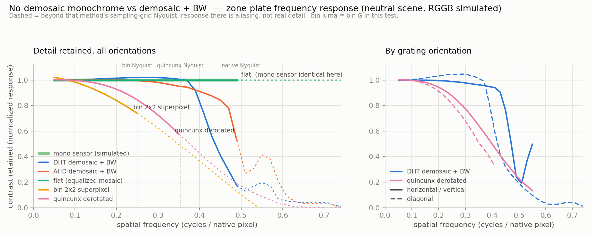
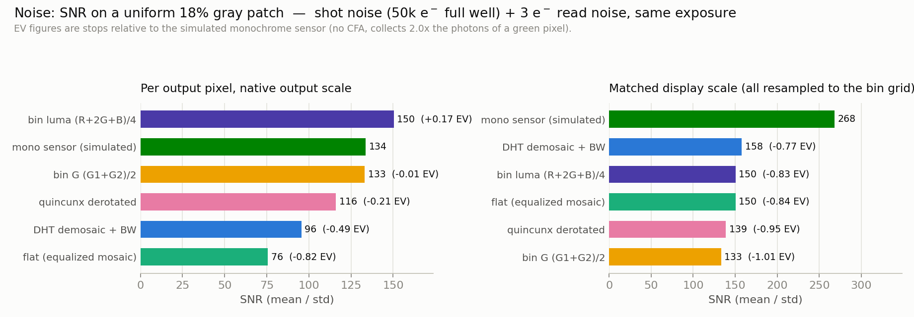
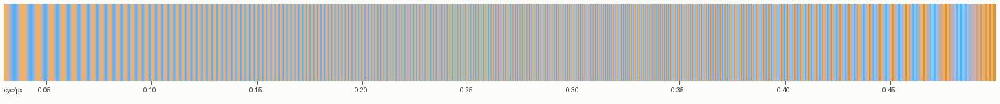

# Abstract

Bayer-sensor cameras convert to black & white by first demosaicing — interpolating three color values at every photosite — and then discarding the color. This estimates values that were never measured, and for monochrome output the estimation is unnecessary. **rwmono** is a command-line tool that converts Bayer raw files (developed against Hasselblad `.3FR`; any LibRaw-supported Bayer format works) directly into monochrome linear DNG files using three interpolation-free strategies: 2×2 super-pixel binning, full-resolution channel equalization, and quincunx re-indexing of the green lattice. This paper describes the science behind each strategy, the implementation (including a from-scratch lossless-JPEG DNG writer), and a quantitative comparison of resolution and noise against conventional demosaic-plus-BW conversion and against a simulated true monochrome sensor. The headline results: on neutral subjects demosaicing retains *more* detail than green-only methods (every CFA pixel is a valid luminance sample there), and the equalized-mosaic mode is exact; the quincunx mode delivers about 85 % of demosaiced horizontal/vertical resolution with zero invented pixels; binning matches a monochrome sensor's per-pixel SNR at half resolution; and a true monochrome sensor retains an unbeatable ~1-stop noise advantage that no CFA processing can recover.

# 1. Background and motivation

A Bayer color filter array (CFA) samples the scene through a mosaic of red, green, and blue filters — one color per photosite, greens on a checkerboard occupying half the sites (Bayer, 1976). Demosaicing reconstructs the missing two channels per pixel by interpolation, exploiting cross-channel correlation. It is a guess — a well-informed one, but a guess — and its failure modes (zipper artifacts, false color, hallucinated texture beyond Nyquist) survive into a B&W conversion as *luminance* errors.

For photographers whose target is monochrome, an alternative exists: skip reconstruction entirely and treat the measured photosite values as the image. The closest prior art is **Monochrome2DNG** (FastRawViewer/LibRaw team), which serves cameras whose CFA has been physically removed; there, every photosite is a valid luminance sample. With the CFA still in place, the core obstacle is that equally-illuminated photosites of different channels record different values — the strategies below are three ways of dealing with exactly that.

The academic framing is *luminance estimation directly from CFA data*, a sub-problem of demosaicing theory: in the spatial-frequency domain a Bayer image separates into baseband luminance plus chrominance modulated at high frequencies (Alleysson et al., 2005; Dubois, 2005), and the green quincunx lattice has well-studied reconstruction properties. rwmono deliberately uses only the simplest, fully transparent members of this family — nothing the pixel data cannot directly justify.

# 2. The three strategies and the science behind them

## 2.1 `bin` — 2×2 super-pixel binning

Each RGGB quad collapses to one output pixel. Two weightings are provided:

- **G weighting** (default): $(G_1+G_2)/2$ — a pure green-channel image. This is the classic B&W green-filter rendering (pleasing skin, lively foliage), using only the two most densely sampled, identically-filtered photosites.
- **Luma weighting**: $(R' + G_1 + G_2 + B')/4$ where $R'$ and $B'$ are equalized to green via white-balance gains and clipped at green's saturation. All four measured photons contribute; noise is lowest.

Output is half the linear resolution and a quarter of the pixels; nothing is interpolated. This is the "super-pixel" mode long used in astrophotography stacking. The effective sampling aperture is the 2×2 quad, whose box-filter MTF rolls off smoothly toward the bin Nyquist of 0.25 cycles/native-pixel.

{width=6.5in}

## 2.2 `flat` — full-resolution mosaic with channel equalization

Keep every photosite at native position and apply per-channel gains $g_R = m_R/m_G$, $g_B = m_B/m_G$ (from the as-shot white-balance multipliers, or user-supplied) — i.e. white-balance the *mosaic itself*. For a neutral (gray) subject, an R photosite then reads the same as its G neighbors, and the mosaic *is* the luminance image at full native resolution: no reconstruction error at all, because there is nothing to reconstruct.

{width=6.5in}

The catch is scene-dependent: wherever the *scene* is saturated in color, R and B photosites legitimately disagree with G, and the disagreement renders as a pixel-level checkerboard lattice. No global gain can fix this — it is chrominance aliasing, the same energy a demosaicer routes into its chroma channels. Highlights are protected by clipping all channels at green's saturation so they clip together.

## 2.3 `quincunx` — the green checkerboard as a rotated square grid

The green photosites form a quincunx (checkerboard) lattice. That lattice *is* a square grid — rotated 45°, with pitch $\sqrt{2}$ native pixels. Re-indexing along the diagonal basis $e_1=(1,1)$, $e_2=(-1,1)$ maps every green sample to exactly one pixel of an upright image; the scene content appears rotated 45° inside a diamond. **Zero interpolation, zero non-green data** — the purest software approximation of a monochrome sensor a Bayer chip can offer.

{width=6.5in}

Sampling theory gives this lattice an interesting anisotropy: its Brillouin zone is the diamond $|f_x|+|f_y| \le 0.5$, so horizontal and vertical gratings are supported all the way to the native Nyquist of 0.5 cycles/pixel, while diagonal gratings alias beyond 0.354. Since man-made scenes are dominated by horizontal/vertical structure, the practical cost is lower than the "half the pixels" arithmetic suggests.

Two practical additions:

- **Gr/Gb equalization.** The two greens of each quad can differ slightly (crosstalk from neighboring red vs. blue rows). On the rotated grid they occupy alternating diagonals, so an imbalance renders as a lattice. rwmono measures the global Gr/Gb ratio per file and equalizes it (on the test camera: 1.00283, i.e. 0.28 %).
- **`--derotate`.** One bicubic (Catmull-Rom) resample maps the rotated grid back to an upright frame of $W/\sqrt{2} \times H/\sqrt{2}$ pixels — the same pixel count as the number of green samples, so no fake resolution is created. This is the single spatial (never chromatic) interpolation a user can opt into; the lattice-faithful mapping preserves the anisotropic frequency support described above.

## 2.4 What none of these can do

A green-only image is the scene *through a green filter*, not scene luminance, and a CFA sensor discards roughly half its photons compared to a filterless monochrome sensor. Section 5 quantifies both points.

# 3. Implementation

rwmono is ~900 lines of dependency-light C++17 (LibRaw is the only external library), organized as:

- **`main.cpp`** — CLI, LibRaw unpacking, black-level handling (common base + per-channel deltas + repeating pattern blocks), CFA-phase-aware processing for all three strategies, and the derotation resampler. All modes run in 0.5–2.5 s for a 100 MP file on Apple Silicon.
- **`dng_writer.cpp`** — a from-scratch monochrome DNG writer. A monochrome DNG is a TIFF with `PhotometricInterpretation = LinearRaw`, `SamplesPerPixel = 1`, and no CFA tags; per the DNG specification, `ColorMatrix1` is required only for non-monochrome files and is correctly omitted. Camera make/model, `UniqueCameraModel` (annotated with the conversion mode), orientation, black/white levels, and an EXIF block (ISO, shutter, aperture, focal length, capture date) are carried over from the source raw.
- **`ljpeg_encoder.cpp`** — a from-scratch lossless JPEG encoder (ITU-T T.81 process 14, SOF3), the only compression the DNG spec permits for 16-bit integer raw data and the same scheme Adobe writes. It builds an optimal Huffman table per image (Annex K algorithm with 16-bit length limiting), uses predictor 1, and byte-stuffs markers. Compression is on by default and **bit-exact**: outputs decoded through LibRaw's independent lossless-JPEG decoder are MD5-identical to the uncompressed path.

Output DNGs validate cleanly (`exiftool -validate`) and open in LibRaw-based software and Apple's native raw pipeline.

# 4. Using rwmono

Build (macOS, Homebrew): `brew install libraw cmake`, then `cmake -B build && cmake --build build`.

```
usage: rwmono <bin|flat|quincunx> <input raw> [options]
  -o <file>            output DNG path (default: input name + _<mode>.dng)
  --weights <g|luma>   bin mode: G-only or (R+2G+B)/4 luma (default g)
  --wb <asshot|R,G,B>  channel gains for equalization (default asshot)
  --no-grgb            quincunx: skip Gr/Gb equalization
  --derotate           quincunx: bicubic resample back to an upright frame
  --autocrop           quincunx: tag the largest inscribed rectangle as
                       DefaultCrop (crops away most of the frame)
  --uncompressed       disable lossless JPEG compression
```

All commands below were run against the reference capture used throughout this paper — a Hasselblad CFV-100c / 907X `.3FR` (11 904 × 8 842 photosites, 11 664 × 8 750 active, RGGB, ISO 64, f/8, 1/250 s, 203 MB):

| Command | Output | Size | Notes |
|---|---|---|---|
| `rwmono bin IMG.3FR` | 5 832 × 4 375 | 32 MB | green-filter look, zero interpolation |
| `rwmono bin IMG.3FR --weights luma` | 5 832 × 4 375 | 30 MB | all photons, lowest noise |
| `rwmono flat IMG.3FR` | 11 664 × 8 750 | 168 MB | native res; neutral scenes only |
| `rwmono quincunx IMG.3FR` | 10 207 × 10 206 | 91 MB | 45°-rotated diamond, purest mode |
| `rwmono quincunx IMG.3FR --derotate` | 8 246 × 6 186 | 60 MB | upright, one spatial resample |

{width=6in}

{width=4.5in}

{width=6in}

# 5. Measured comparison

## 5.1 Methodology

**Resolution.** A synthetic zone plate (all spatial frequencies to beyond Nyquist, all orientations, analytically known ground truth) was rendered as a neutral scene with 2×2-supersampled pixel aperture, mosaicked with Hasselblad-like channel sensitivities (R = 1/2.63, B = 1/1.62 of G), and written as a Bayer DNG. Both pipelines consumed the same file: rwmono's three modes on one side; LibRaw's AHD and DHT demosaicers followed by Rec. 709 luma conversion on the other. A **simulated monochrome sensor** — every native photosite sampling scene luminance directly, no CFA — was added as reference. Because each method's output-grid-to-scene mapping is known exactly, the retained contrast at each frequency is measured as the least-squares gain of the output against the analytic reference per frequency band (a matched filter: blur lowers it, aliasing junk decorrelates to ~0), normalized at low frequency. The neutral scene is deliberately demosaicing's *best* case.

**Noise.** Uniform patches at 2 %, 18 %, and 50 % of full scale were simulated with Poisson shot noise (50 000 e⁻ full well at G saturation) and 3 e⁻ RMS read noise at identical exposure, mosaicked with the same sensitivities, and pushed through every real pipeline. The monochrome sensor collects the summed pass-bands of the three CFA channels — 2.0× a green photosite's photons, consistent with the white-balance data and the folklore "about one stop." SNR (mean/std) is reported per output pixel at each method's native output scale, and again with every output box-resampled to the bin grid (matched display scale), which credits full-resolution outputs for their downsampling headroom.

## 5.2 Resolution results

{width=6.5in}

| Method | MTF50 | MTF10 | MTF50 H/V | MTF50 diag | Grid Nyquist |
|---|---|---|---|---|---|
| mono sensor (simulated) | exact* | exact* | exact* | exact* | 0.50 |
| AHD demosaic + BW | 0.51 | 0.61 | — | — | 0.50 |
| DHT demosaic + BW | 0.45 | 0.59 | 0.49 | 0.43 | 0.50 |
| flat (equalized mosaic) | exact* | exact* | exact* | exact* | 0.50 |
| quincunx derotated | 0.39 | 0.55 | 0.41 | 0.37 | 0.354–0.50 |
| bin 2×2 (g ≡ luma here) | 0.35 | 0.51 | 0.35 | 0.37 | 0.25 |

*Frequencies in cycles/native pixel. "exact\*": response ≈ 1.0 across the measured range — on a neutral scene these methods reproduce the sampled scene with no reconstruction error. For `flat` this guarantee **only** holds on neutral content (§ 5.4).*

Key observations:

1. **Demosaicing does not lose luminance detail on neutral subjects.** After white balance, every photosite — red, green, and blue — is a valid luminance sample there, and demosaicers exploit it, resolving essentially to the native Nyquist. The response demosaicers show *beyond* 0.5 (the bump near 0.55) is manufactured false detail: real artifacts, not real information.
2. **`flat` is exact on neutral content and identical to the monochrome sensor there** — the strongest possible result, with a hard scene-dependence caveat.
3. **`quincunx` is orientation-smart:** MTF50 of 0.41 horizontal/vertical (85 % of DHT's 0.49) falling to 0.37 diagonal, exactly as lattice theory predicts. Everything it shows is measured, never invented.
4. **`bin` is clean to its Nyquist** and degrades gracefully into honest aliasing beyond.

{width=6.5in}

## 5.3 Noise results

{width=6.5in}

| Method | SNR @2 % | SNR @18 % | SNR @50 % | @18 % matched scale |
|---|---|---|---|---|
| mono sensor (simulated) | 44.6 | 133.7 | 223.5 | **268.1** |
| bin luma (R+2G+B)/4 | 50.1 | 150.3 | 253.4 | 150.3 |
| bin G (G1+G2)/2 | 44.4 | 133.2 | 223.9 | 133.2 |
| quincunx derotated | 38.7 | 116.0 | 194.3 | 138.8 |
| DHT demosaic + BW | 31.9 | 95.5 | 159.7 | 157.6 |
| flat (equalized mosaic) | 25.1 | 75.6 | 126.4 | 150.3 |

Reading the table:

- **Binning buys back the monochrome sensor's per-pixel SNR.** bin G matches the mono sensor per pixel (133 vs 134) — at half the resolution. bin luma exceeds it slightly by averaging all four photosites.
- **At matched display scale the monochrome sensor wins by ~0.8–1.0 EV over everything** (268 vs 158 for the best CFA method). This is physics — the CFA discarded the photons — and no processing recovers it.
- **`flat` has the worst per-pixel noise** (−0.82 EV vs mono): red photosites are amplified 2.63× by equalization, so noise is both higher and *spatially patterned* (a gain checkerboard). Downsampled to the bin grid it becomes exactly bin luma (150.3) — the two are the same measurement at different scales.
- **Demosaic+BW sits between**: interpolation averages neighboring samples, trading its resolution advantage for noise smoothing; at matched scale it is marginally the best CFA option (157.6) because it uses all photons at full grid density.
- Read noise is negligible above 2 % here; at very low signal all CFA methods converge toward the same photon-starved penalty vs. mono.

## 5.4 Real-image verification (Hasselblad CFV-100c capture)

{width=6.5in}

Quantitative spot checks on the same capture: per-CFA-phase means in a *neutral gray pavement* patch of `flat` output agree within **3.1 %** (the mode works); in *saturated blue sky* they spread **76.7 %** (R = 5 081, G = 7 240, B = 10 923) — the checkerboard below, which no global gain can remove. The measured Gr/Gb imbalance was 1.00283 (0.28 %), corrected automatically in quincunx mode.

{width=3.2in}

A note on this test's scope: the zone-plate study is neutral-only — demosaicing's best case. On strongly colored high-frequency content, demosaicers additionally hallucinate luminance artifacts from chroma edges after BW conversion, while the green-only modes (`bin` g, `quincunx`) are immune by construction; `flat` degrades as shown above. Section 7 demonstrates and quantifies this on a purpose-built chroma target.

# 6. Conclusions and recommendations

The honest conclusion first: **for general-purpose real-world B&W photography, demosaicing followed by conversion is the rational default, and this project's own measurements say so.** On neutral content demosaic+BW retains more detail than any green-only method (§ 5.2) and `flat` merely ties it, with a scene-dependent failure mode demosaicing does not have. At matched viewing scale demosaic+BW is also the best-noise CFA option (§ 5.3). Above all, it keeps the color information alive: the classic red/orange/yellow/green filter renderings remain a slider in post, whereas every rwmono mode commits to one spectral rendering — the green-filter look — irreversibly, at conversion time. The project's founding intuition, that skipping demosaicing preserves *more* detail, is refuted by our own data for typical scenes.

What survives that concession is specific, and worth stating precisely:

1. **The filter-in-post flexibility has a hidden asymmetry.** A simulated color filter mixes *demosaiced estimates*. Green-heavy mixes rest on the well-sampled quincunx and are solid; but a strong red-filter mix leans on the R channel — sampled at quarter density, true Nyquist 0.25 cycles/pixel, exactly `bin`'s — presented at native resolution with interpolation filling the gap, plus the chroma aliasing of § 7. "Any filter at full resolution" overstates what the mosaic measured; the rwmono modes make the same sampling limits explicit instead of hiding them.
2. **Moiré-prone subjects are a real niche, not a philosophy.** Fine textiles, distant brick and signage, halftone print, and LED screens do reach the R/B Nyquist on a 100 MP AA-filterless sensor. In a color image, chroma moiré is visible *as color* and treatable; after a B&W conversion it is indistinguishable from scene texture and unremovable. § 7 measures the effect and § 7.1 shows where it lives in real content. For large B&W prints of such subjects, `bin` G or `quincunx` is a remedy demosaicing cannot offer.
3. **Archival economics.** A capture already committed to monochrome and to the green rendering keeps a 30 MB `bin` DNG instead of a 203 MB raw — still linear, still with highlight headroom, openable anywhere. That "already committed" is doing real work, and it is the honest boundary of the use case.
4. **Measurement-grade imaging.** Where pixel values must be measurements rather than estimates (astronomical stacking, reprography, technical documentation), super-pixel binning is standard practice for exactly the guarantees rwmono provides.

Within those niches the recommendations stand: **`bin` G** as the default (bulletproof, monochrome-sensor per-pixel SNR, quarter-size files, chroma-immune), **`quincunx --derotate`** when resolution matters (~85 % of demosaiced H/V resolution, zero chromatic guessing), **`bin` luma** only for scenes without high-frequency color (§ 7), and **`flat`** as an expert option for low-saturation scenes. A true monochrome back retains a ~1-stop noise advantage at matched viewing scale that no CFA processing — rwmono's or a demosaicer's — can recover. That is physics, not software.

# 7. Addendum: chroma-induced luminance hallucination

Section 5 measured demosaicing at its best — neutral content, where cross-channel correlation holds perfectly. This addendum constructs the opposite case and shows what each pipeline does with it.

**Test scene.** Vertical red↔blue stripes whose frequency is chirped from 0.03 to 0.50 cycles/pixel left to right — shown below in color as the camera would see it. The green channel is strictly constant, and R + B is constant (the stripes swap red for blue, never brightness in the sum). The true Rec. 709 luminance therefore carries only a small real ripple (~9 % of its mean, from the different R and B luma weights) at *every* frequency — the analytic ground truth in the top strip of the B&W panel. Crucially, red and blue photosites each sample the scene at a pitch of 2 pixels, so their Nyquist limit is **0.25 cycles/pixel**: beyond it, no pipeline can measure the stripes from R/B data — it can only guess, alias, or ignore.

{width=6.5in}

{width=6.5in}

Measured ripple amplitude (std of the detrended horizontal profile, % of each output's mean):

| Pipeline | f = 0.05–0.20 (measurable) | f = 0.30–0.45 (beyond R/B Nyquist) |
|---|---|---|
| ground truth (Rec. 709 luma) | 8.9 % | 9.0 % |
| DHT demosaic + BW | 8.2 % | **15.3 %** |
| AHD demosaic + BW | 8.2 % | **15.3 %** |
| bin G (G1+G2)/2 | 0.0 % | 0.0 % |
| bin luma (R+2G+B)/4 | 12.5 % | **28.6 %** |
| quincunx derotated | 0.0 % | 0.0 % |

Three distinct behaviors emerge:

1. **Demosaicers hallucinate.** Below 0.25 cyc/px both AHD and DHT track the true ripple (8.2 % vs 8.9 %). Beyond it they render ~1.9× their own correct level and ~1.7× the truth — and, worse than the amplitude, the *structure* is wrong: the panel shows broad, high-contrast bands at frequencies the scene does not contain. In a real photograph (fine textiles, distant colored signage, foliage against sky) this is luminance detail that was never there, permanently baked into a B&W conversion.
2. **Green-only modes are immune by construction.** `bin` G and `quincunx` render the chroma-only pattern as a uniform field (0.0 %) — exactly what a green-filtered monochrome capture of this scene would record. This is a *rendering stance*, not a free lunch: real luminance variation that happens to hide in R/B alone is rendered flat too. It is, however, never *false* detail.
3. **`bin` luma inherits the CFA's chroma aliasing — amplified.** Its R and B quarter-density samples fold high-frequency chroma straight into the output with only the 2×2 box average as protection: 28.6 % ripple in the aliased band, the worst of all pipelines tested, and visible in the panel as hard dark banding. Its low-band figure (12.5 %) is not an error — it is the legitimate ripple of its own equal-weight BW mix — but the high band is pure aliasing.

The practical guidance follows directly: **on subjects with fine saturated-color detail, prefer `bin` G or `quincunx` over both `bin` luma and demosaic-based conversion**; reserve `bin` luma's noise advantage (§ 5.3) for scenes without high-frequency chroma. This sharpens, rather than changes, the recommendations of § 6.

## 7.1 Where this lives in real photographs

The chirp target isolates the mechanism; this subsection asks how much of it survives in ordinary photographic content. To get a real-world test *with known ground truth*, the demosaiced Berlin capture was box-downsampled 3× — at the new scale it is simply a fully known RGB scene (any demosaic residue in it becomes legitimate scene content) — then re-mosaicked with the same channel sensitivities and pushed through every pipeline again.

{width=6.5in}

Measured against each pipeline's own target rendering (Rec. 709 luma for the luma pipelines, the green channel for `bin` G and `quincunx`), normalized RMS errors on this scene are small and comparable: DHT 1.9 %, `bin` G 1.9 %, `bin` luma 1.7 %, `quincunx` 2.6 %. That is an honest and important negative result: **on ordinary content, even with saturated colors present, demosaicing's errors are modest** — most photographs simply do not put chroma at the sampling limit, which is exactly why demosaic+BW is a good general default (§ 6). Note the figures are not directly rankable across the two target renderings; they describe each method's fidelity to its own goal.

The *nature* of the errors, not their magnitude, is what separates the pipelines. Zooming into the region where the errors concentrate — fine foliage behind a parapet — and mapping each output's deviation from its target:

{width=6.5in}

This is the practical summary of the whole section: demosaicing errs by **inventing**, no-demosaic errs by **blurring**, and on typical content both err little. Subjects that push chroma toward the sampling limit — where the invention becomes visible and permanent in B&W — include fine textiles and knits (houndstooth, tweed), distant colored signage and traffic markings, brick and roof-tile courses, printed halftones, LED/LCD screens, feathers, and backlit foliage edges. Photographers of such subjects are the audience for whom `bin` G and `quincunx` exist.

# References

- B. E. Bayer, "Color imaging array," U.S. Patent 3,971,065 (1976).
- D. Alleysson, S. Süsstrunk, J. Hérault, "Linear demosaicing inspired by the human visual system," *IEEE Trans. Image Processing* 14(4), 2005.
- E. Dubois, "Frequency-domain methods for demosaicking of Bayer-sampled color images," *IEEE Signal Processing Letters* 12(12), 2005.
- ITU-T Recommendation T.81 (JPEG), Annex H (lossless processes) and Annex K (Huffman table generation), 1992.
- Adobe Systems, *Digital Negative (DNG) Specification*, version 1.4.
- LibRaw LLC, *LibRaw* raw decoding library; *Monochrome2DNG* converter, FastRawViewer.
